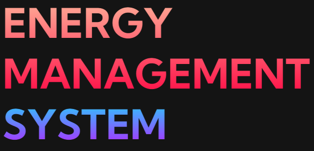
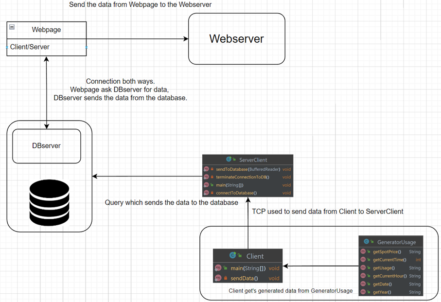
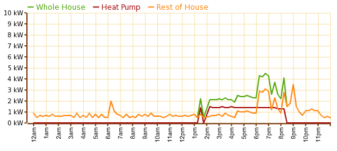
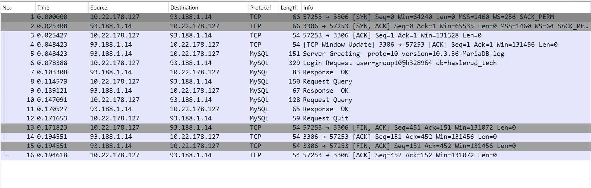

# **Project Report IDATA2304 Autumn 2022**
This is a prototype solution created by four computer science students in the course IDATA2304 Computer Networks.

## **Termonology**
### **Term and Definition** 

1. **TCP** -> *Transmission Control Protocol (TCP) is one of the main [protocols](https://en.wikipedia.org/wiki/Communication_protocol) of the [Internet Protocol suite](https://en.wikipedia.org/wiki/Internet_protocol_suite).* [Wikipedia](https://en.wikipedia.org/wiki/Transmission_Control_Protocol)

2. **Database** -> *In [computing](https://en.wikipedia.org/wiki/Computing), a database is an organized collection of [data](https://en.wikipedia.org/wiki/Data_(computer_science)) stored and accessed electronically*. [Wikipedia](https://no.wikipedia.org/wiki/Database)

3. **Spot Price** -> *A spot price is the price retailers pay when the buy electricity form the wholesale market. Spot prices change every half-hour nd can vary quite dramatically depending on supply and demand. Typically spot prices are higher during winter, and weekdays at breakfast and dinner time*. [Electricity Authority](https://www.ea.govt.nz/consumers/my-electricity-bill/is-a-spot-price-contract-right-for-me/)

4. **Inflation** -> *In [economics](https://en.wikipedia.org/wiki/Economics), **inflation** refers to a general increase in the prices of goods and services in an economy* [Wikipedia](https://en.wikipedia.org/wiki/Inflation)

5. **Interest Rates** -> *An **interest rate** is the amount of [interest](https://en.wikipedia.org/wiki/Interest) due per period, as a proportion of the amount lent, deposited, or borrowed (called the [principal sum](https://en.wikipedia.org/wiki/Debt#Principal))*. [Wikipedia](https://en.wikipedia.org/wiki/Interest_rate)

6. **Sequence Number** -> *Sequence number is a number defined in TCP protocol, used to track the order of the incomming packets.*

7. **ACK** -> *ACK is an aknowledgment message sent in the TCP protocol, to ensure the sender that the packet has been recieved sucsessfully.*

8. **Protocol** -> *A defined set of rules and regulation for standardization transmitt of packets and the build of packets over a network.*

9. **HTTP** -> *Protocol for sending html(web pages) through a [network](https://en.wikipedia.org/wiki/Computer_network).*

## **Abstract**
The world is going into a global crisis situation where the energy prices, gas prices, inflation and the interest rates are reaching for the sky. These factors are causing extremely high energy and consume prices, and is making it very difficult for people to pay their electricity bills. 

Because of all the problems this has caused, as well as the media attention, we were encouraged to create something that would make it easier for people to have control of their energy usage, and the cost of this. Therefore, we created a prototype where the user is provided with a full rundown of their electricity consumption. Users can see where they use the most electricity and what the price is on during the day. With this people can reduce their energy consumption and organize it to when it is cheapest during the day. From discussions people has agreed what this prototype solution could have a big impact on their electricity usage and help them become more aware of it. We have tested with real sensors, but our Raspberry Pi short circuited, therefore we continued the process with dummy data.  

Our solution results in better awareness, less and cheaper energy usage. Possible future additions include statistics, sensors stationed in multiple rooms and homes, login and register function and analysis. 

## **Introduction**

Our solution is planned to private homes, companies, but also usable in other aspects where you would want to track you electricity usage. The problem we have encountered in the world is high energy consumption and spot prices, which make for high energy prices that people and companies struggle to pay. Our solution provides an overview of ones electricity consumption, and can help them choose when during the day they can do electricity consuming activities, in order to minimize their electricity bills. This way people can take action on the high prices. 

### **Contents**
* ### [Termonology](#termonology)
* ### [Abstract](#abstract)
* ### [Introduction](#Introduction)
* ### [Theory and Technology](#theory-and-technology)
* ### [Methodology](#methodology)
* ### [Results](#result)
* ### [Discussion](#discussion)
* ### [Conclusion and Future Work](#conclusion-and-future-work)
* ### [References](#referances)

## **Theory and technology**

### **Structure of application**

The project consist of GeneratorUsage.java that creates dummy data for the application, backend and a frontend structure. The Database and web part is based in Loopia where it got purchased a domain name "haslerud.tech" by Even Johan Pereira Haslerud, so that the project was inluded an MySQL/MariaDB, UNIX (PHP 8.1/Apache 2.4) configuration, FTP user and SSL which  we could include in the project to get it more secure, will get back on that. 

The backend components are the client.java and ClientServer.java. Client.java formats the data received from a generator, which works as a virtual sensor, and sends it to the ClientServer.java. The job of ClientServer.java is to act as a server for the client class and a client for the DBMS server. By this we mean that the server's responsibility is to wait for the client to send data, the client's responsibility is to handle the data, insert it into the SQL insert command and then connect to the DBMS and run the command there. With the database knowledge we got from IDATA2303 Data modeling and Database applications, we was able to implemented SQL queries in the ClientServer, so that we could insert the formatted data into the Database based on these queries.

The client.java and ClientServer.java is based on TCP which is connection-based, so it establishes a connection between the receiver and sender and maintains it while transferring data. The TCP protocol in transport layer gurantees that the data arrives completely intact, something that we saw as necessary in our project. In the picture below is an UML chart and shows how the nodes communicates.

"UML chart."

### **Database**

The project is based on a MySQL/MariaDB database where we store the data sent from the backend part. The database is hosted on Loopia where we use MySQL/MariaDB, where we have our user on phpMyAdmin that is a free software tool written in PHP, that is intented to handle the administration of MySQL over the Web. 

To send the information from the program to the database, we used Java Database Connectivity (JDBC) to establish a connection to the MariaDB server. By using an INSERT query, the data is organized correctly into the database. The database is the applications memory, it handles all our data and makes it possible to manipulate it in the directions wanted. It is used to print out graphs visualizing the electricity usage.

### **TCP and data transference**

Our program relies on reliable data transfer. In order to transfer the given data from the generator or sensor it is crucial that every detail of the information is transferred. To ensure this, our program takes use of the data transfer protocol called Transmission Control Protocol (TCP) when data is exchanged between Client.java and ServerClient.java. Reliable data transfer between these classes are crucial for the data. The usage of TCP makes the data transfer solid so we can upload the data to our database, knowing it is correct. If we decided that TCP was not necessary and tried using a different transfer protocol like UDP, we could not ensure valid data. This may cause the data displayed on our website to be unreliable or even corrupted. The reasoning of this is that UDP protocol does not include a 3-way handshake like TCP that guarantees reliable data transmission. The application would function with UDP, but it would not ensure that the graphs or data presented on the sites are correct and viable.

### **Generating Data**

A primary function in the project is that data represents electricity usage. There were several solutions to this problem, for example using an electricity sensor that was plugged in an outlet. This would return numbers on how much energy that was being used in that room and would be a good option, but such a sensor was not available. Therefore, the application ended up generating dummy data based on energy usage of an average household.

To generate this data, the generator class represents an energy sensor. The data retrieved from the generator is the current time, date, and electricity used in one hour. To make the generated data as realistic as possible, the data returned is based on the time of the day. Based on information from different charts, the generator is adjusted so that from 00:00 to 10:00 o’clock the KWH levels are stable, with little to no change. From 10:00 to 14:00 the levels have a noticeable increase, and by the added range, the output data has some random changes, making it more realistic. From 14:00 to 18:00 the usage remains quite stable, and the real change come around 18:00 to 00:00. Here the electricity usage increases drastically, due to people coming back to their house, cooking dinner, watching TV and other activities consuming electricity.

 1. 

Researchgate

### **Web**

The web development we use CSS, HTML5, JavaScript and PHP. The CSS and HTML5 (Hypertext Markup Langauge) is for styling and designing the website. HTML is the standard markup langauge for Web pages and CSS is the language we use to style an HTML documet and CSS describes how HTML elements should be displayed.

The database and the hosting services for the website "haslerud.tech" is done by Loopia. This gave us the ability to easier create a database, SSL certificate if we wanted and making the project more real. 

As metioned we used PHP in order for the website to get the data from the database. We have two PHP files that have the needed information to create a connections to the database, they are called session.php and db.php. The other PHP files access the database with implemented queries so that we can get the data from the database and inorder to manage it to the website we use JSON encoding so that it can return a string containing the JSON representation of the supplied value. And if the parameter is an array or object, it will be serialized recursively.As metioned we used JavaScript with AJAX so we could read data from the database, without needing to update the website all the time. 

### **WireShark**

To checking the connection between the DBMS and the java backend we troubleshooted using wireshark.  This shows that the ServerClient is speaking to the DBMS. The packets we are discussing, are the packets in the picture using the MySQL protocol. By analyzing the packets, the content of the packets could be extracted, and we cross checked it with the SQL queries outputted in the terminal for ServerClient. The MySQL protocol, like the TCP protocol, uses ACK or in this case OK messages which confirms that the data sent was received successfully. After the last query is sent and confirmed received, our backend closes the connection, this message has not an OK message in opposition to the TCP protocol. We could not find any packets between the Client and the ServerClient, this is because it uses localhost and is not transmitting packets over wifi.

## **Methodology**

Our workflow has consisted mainly of working together as a group and assigning tasks for each other that must be completed before next meeting. We did some testing with raspberry PI and temperature sensor, but did not implement this in the application since we focused on energy usage. With a kwh sensor it could implement real life data, but the data is currently generated by code. Spot price is also code generated, and is currently based on an average for postal code 6009 Ålesund. The data is then sent to a client every hour using TCP to provide reliability. The client then connects to the database and inserts it into the database with all the necessary values.  

## **Result**

### **Backend**

Our data is transmitted from a simple java backend to a central database. This database is hosted on a server which our website retrieves information from. The data in the database is sent by our java backend. The backend is made up of 3 classes, a generator, a client, and a client/server. 

The generator has divided responsibility, it does not only generate data representing a sensor which cover the usage of electricity but also mimics a solution which retrieves current spot prices from 6009 Ålesund from the web, or electricity companies. 

Client is the class that’s acts as a bridge between the sensors and the rest of the application, it sends the data from the generator to a receiver. The client tries to connect to a ServerSocket, after the connection is made, the client sends data. Furthermore, the client class rather than close the connection, holds the connection open and waits an hour before it transmits a new set of data.

The ServerClient is the first class that runs in the application, this is because it is the server in the first data transfer instance. It opens a socket that client can connect to, after the connection is established, ServerClient will wait for incoming packets from the client. Connection between the two classes will be terminated automatic after ServerClient has received 100 sets of data, this means it will run continuously in 100 hours before it needs to be restarted. This is implemented to ensure that the application does not run when unsupervised. This way the application can preserve energy when it isn’t necessary to run. ServerClient then establishes a connection to the database through the database management system (DBMS). After the acknowledgment from the DBMS indicating that data has been added to the database, the ServerClient closes the connection to the database, the termination and establishment of connection to the database is done between every data transfer. It does this to keep the connection more secure. The window for exploiting the connection will be drastically reduced. Data that the ServerClient is receiving, is formatted inside static SQL queries which we have learned about in IDATA2303.

### **Frontend**

The results we got in front end is that we got to display the graph from the data that was inserted in the database from GeneratorUsage.java. We have some buttons that doesn't function, because them are for future work on the project. But on the home button we can display the graph of usage(kWh) and a graph of the price used in kr. And on the Spot Price button we get to display the spot price based on the data from the database created from the GeneratorUsage.java.

## **Discussion**

We wanted to get data from a sensor and tried getting data from a raspberry pi which measures the temperature. With the temperature measurer we were able to make a graph which updates every 0,5 seconds. Sadly, the raspberry pi short circuited, and we figured that it would be better to use generated data. The generated data would be better for what we were trying to make but figured that we could implement the raspberry pi data in the future.     

## **Conclusion and Future Work**

The prototype of the application currently provides us with the ability to see the current spot price and electricity usage, and combines these two to give us the total cost per hour in kroner.

### *Login and Register*
In this section about future work, we wanted to create a new Table in the Database and button functioning in the web. Where users would be able to create their own user with username, password and two aunthentication. This would make the web more secure for the user and make them more confident for the hole application. 

### *Automation*
In this part of automation we want the users to able to create morning and nigth automations. Where they can lower the temperature, turning of the lights automatically when they are going to bed. And the morning automation will go on when the people set the clock to when the different heating and lights will go on.

Could also add a work automation that turn of all lights and lower the heating when poeple are going to work or travelling to other countries. Everything can be handled in the web and easy over the internet.

### *House Display*

In the house display part we would organize the hole house like a map, where the user can get full overview over all the rooms in the house and how much kWh. And if the lights are switched on in a certained room, heating, etc.

### *Future Energy Usage*

In th section of Future Energy Usage we would like to use our knowledge from ISTA1003 Statistics where we would use regression to solve future electricity bills for the users based on the historical usage and payments. So, that the user can set of money and know how much the next month are going to cost. 

### *Real Data*

In this part we would give the users a sensor which them could implement in each room, so that we have control of the usage in every room. And that the whole applicaton was based on real raw data instead of dummy data.

### *Security*

This part is the most important for us, and that is we would run our web page on HTTP, but we would buy an SSL certificate that makes the web much more secure. We would then run our webpage on HTTPS and would get more trust from our users, and we would be more secure that data breaches like sensitive information don't would leak. 

## **Referances**

1. [Researchgate](https://www.researchgate.net/figure/Example-of-power-consumption-of-a-household-over-a-24-hour-period-measured-in-kW_fig3_235644349), picture visualizing the the consetp used in generator class. (03.12.2022, Researchgate)
